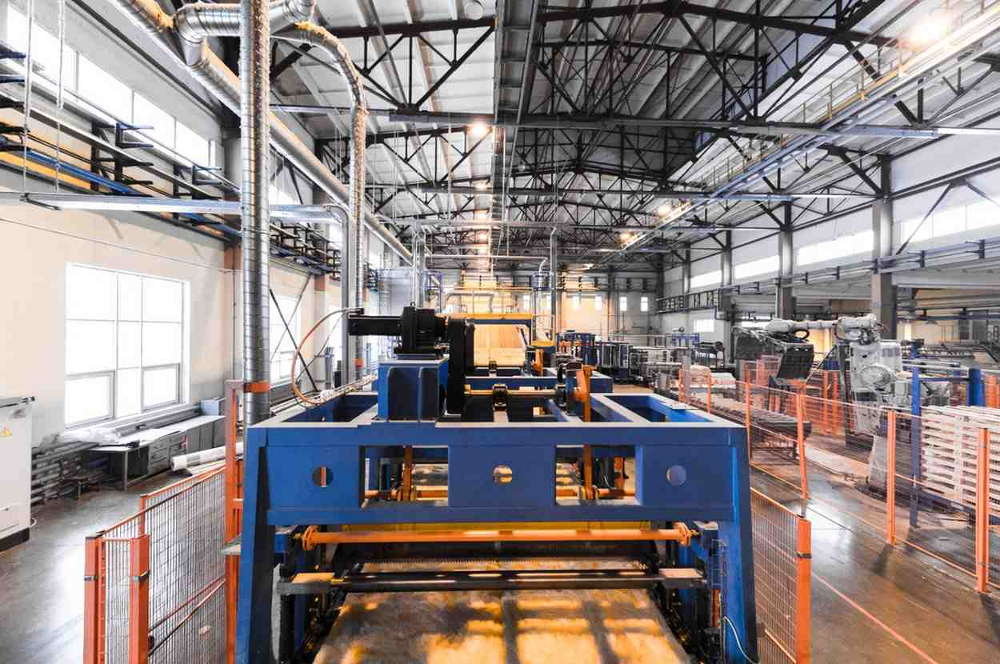

# Praava Graphics

A modern, high-performance corporate website designed for an industrial manufacturing and engineering company. This project showcases heavy machinery products, engineering services, and company capabilities with a focus on premium aesthetics and user experience.



## 🚀 Overview

Praava Graphics represents the digital presence of a leader in industrial solutions, specializing in conveyor systems, log stackers, and press rebuilds. The application is built to demonstrate technical expertise not just in manufacturing, but in digital presentation, utilizing 3D models and smooth animations to engage potential clients.

## ✨ Key Features

- **Premium UI/UX Design**: A sleek, industrial-themed interface with responsive layouts using Tailwind CSS and shadcn/ui.
- **Interactive 3D Elements**: Integrated 3D model viewers using `Three.js` and `@react-three/fiber` for immersive product exploration.
- **Dynamic Content**: dedicated pages for Products (Conveyors, Stackers) and Services (Rebuilds, Relocation, Troubleshooting).
- **Responsive Animations**: Smooth transitions and scroll effects powered by `tailwindcss-animate` and modern CSS techniques.
- **Contact & Inquiry System**: Integrated contact forms for customer inquiries and support.

## 🛠️ Technology Stack

This project leverages a modern frontend ecosystem to ensure performance, type safety, and scalability:

- **Framework**: [React](https://reactjs.org/) (v18)
- **Build Tool**: [Vite](https://vitejs.dev/) - for lightning-fast HMR and building.
- **Language**: [TypeScript](https://www.typescriptlang.org/) - for robust, type-safe code.
- **Styling**: [Tailwind CSS](https://tailwindcss.com/) - utility-first CSS framework.
- **UI Components**: [shadcn/ui](https://ui.shadcn.com/) - accessible and customizable component library.
- **3D Graphics**: [Three.js](https://threejs.org/) & [React Three Fiber](https://docs.pmnd.rs/react-three-fiber).
- **Routing**: [React Router](https://reactrouter.com/).
- **State Management**: [TanStack Query](https://tanstack.com/query/latest) (React Query).
- **Icons**: [Lucide React](https://lucide.dev/).

## 📦 Getting Started

Follow these steps to set up the project locally on your machine.

### Prerequisites

- Node.js (v18 or higher)
- npm or yarn

### Installation

1.  **Clone the repository**
    ```bash
    git clone https://github.com/srajankotian37/Praava_Graphics.git
    cd Praava_Graphics
    ```

2.  **Install dependencies**
    ```bash
    npm install
    ```

3.  **Start the development server**
    ```bash
    npm run dev
    ```

4.  **Open the application**
    Open [http://localhost:8080](http://localhost:8080) (or the port shown in your terminal) to view the app.

## 📁 Project Structure

```bash
Praava_Graphics/
├── public/              # Static assets (images, 3D models)
├── server/              # Backend server code (Node.js)
├── src/
│   ├── components/      # Reusable UI components (Hero, Navbar, etc.)
│   │   ├── three/       # 3D model specific components
│   │   └── ui/          # shadcn/ui primitive components
│   ├── hooks/           # Custom React hooks
│   ├── lib/             # Utility functions
│   ├── pages/           # Full page components (Home, Products, Contact)
│   ├── App.tsx          # Main application entry
│   └── main.tsx         # DOM rendering
├── .gitignore
├── package.json
└── vite.config.ts
```

## 🤝 Contributing

1.  Fork the repository.
2.  Create a new branch (`git checkout -b feature/AmazingFeature`).
3.  Commit your changes (`git commit -m 'Add some AmazingFeature'`).
4.  Push to the branch (`git push origin feature/AmazingFeature`).
5.  Open a Pull Request.

## 📄 License

This project is licensed under the MIT License - see the [LICENSE](LICENSE) file for details.
